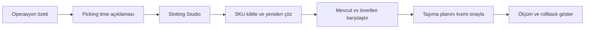
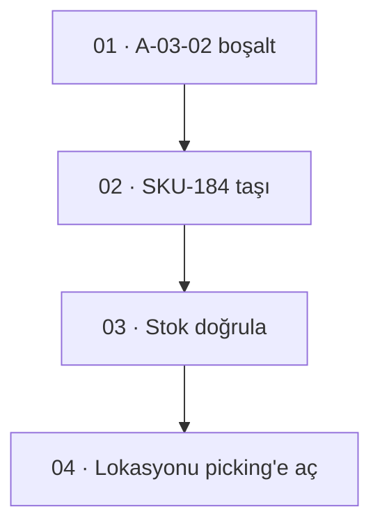

# GBSoft Picking Time & Slot Optimization

## Demo ürün ve UI uygulama şartnamesi

**Belge türü:** Tasarım + ürün + frontend uygulama spesifikasyonu  
**Hedef çıktı:** Sunumda çalıştırılabilir, verisi tutarlı, görsel olarak kurumsal bir web demosu  
**Tarih:** 8 Ağustos 2026  
**Dil:** Türkçe arayüz; mimari İngilizce terimlere uyumlu  
**Durum:** Uygulamaya hazır kapsam

---

## 0. Bu dosya nasıl kullanılmalı?

Bu dosya; ürün tasarımcısı, frontend geliştirici ve demo verisini hazırlayan kişinin aynı ürünü üretmesini sağlayan ana referanstır.

Uygulamaya başlamadan önce şu bölümler birlikte okunmalıdır:

1. **Demo hikâyesi:** Kullanıcıya hangi değerin gösterileceğini tanımlar.
2. **Görsel tasarım yönü:** Arayüzün nasıl görünmesi ve özellikle nasıl görünmemesi gerektiğini belirler.
3. **Ekran şartnameleri:** Her sayfanın yerleşimini, bileşenlerini ve davranışlarını açıklar.
4. **Demo veri modeli:** Bütün sayıların ve etkileşimlerin tutarlı kalmasını sağlar.
5. **Kabul kriterleri:** Demosu bitmiş sayılacak kalite seviyesini tanımlar.

Bu demo gerçek bir WMS değildir. Bir karar ve optimizasyon katmanının nasıl çalışacağını ikna edici biçimde göstermelidir.

---

# 1. Ürün anlatısı

## 1.1 Tek cümlelik değer önerisi

GBSoft, depodaki picking görevlerinin ne kadar süreceğini bileşenlerine ayırarak tahmin eder; hangi SKU'nun hangi lokasyonda bulunması gerektiğini toplam picking, replenishment, congestion ve taşıma maliyetini birlikte değerlendirerek önerir.

## 1.2 Demo sonunda kullanıcı ne anlamalı?

Demo izleyicisi şu beş noktayı net biçimde anlamalıdır:

1. Sistem yalnız yürüyüş mesafesini ölçmüyor; toplam picking süresini açıklıyor.
2. Yüksek hızlı ürünü kapıya yaklaştırmak tek başına yeterli değil.
3. Slot önerileri fiziksel kapasite ve operasyon kurallarını ihlal etmiyor.
4. Öneri uygulanmadan önce kazanç, maliyet ve risk karşılaştırılabiliyor.
5. Kullanıcı önerinin tamamını kabul etmek zorunda değil; kilitleyebilir, değiştirebilir ve kısmi yayınlayabilir.

## 1.3 Ürünün demo adı

Arayüzde ana ürün adı:

> **GBSoft Warehouse Intelligence**

Aktif modül adı:

> **Picking & Slotting**

Sayfa başlığında sürekli uzun ürün adı kullanılmamalıdır.

## 1.4 Demo kapsamı

Demo aşağıdaki yetenekleri göstermelidir:

- Canlıya yakın depo operasyon özeti
- Picking time P50/P90 tahmini
- Süre bileşenlerinin açıklanması
- Mevcut slot düzeni ve ısı haritası
- Önerilen SKU-lokasyon düzeni
- Mevcut ve önerilen plan karşılaştırması
- SKU veya lokasyon kilitleme
- Kısıt değiştirerek yeniden optimizasyon
- Uygulanabilir taşıma görevleri üretme
- Kısmi plan onayı
- Veri kalitesi ve güven göstergeleri
- Rollback yapılabileceğini gösteren sürüm geçmişi

## 1.5 Demo kapsamı dışında

- Gerçek WMS stok muhasebesi
- Fatura, ERP veya muhasebe ekranları
- Gerçek çalışan performans sıralaması
- Personel primi veya disiplin kararı
- Gerçek zamanlı robot/AMR kontrolü
- Karmaşık üç boyutlu depo simülasyonu
- Kullanıcıya sahte bir “AI düşünüyor” animasyonu
- Gerçek olmayan tasarruf garantisi

---

# 2. Demo hikâyesi

## 2.1 Ana senaryo

Demo, İstanbul'daki kurgusal **Marmara Dağıtım Merkezi** üzerinden çalışır.

Operasyonun mevcut durumu:

- 4 picking zonu
- 12 koridor
- 96 aktif pick lokasyonu
- 184 SKU
- 38 açık wave
- 2.840 günlük order line
- Son vardiyada 14,6 saniye/line ortalama sapma
- A-03 ve A-04 koridorlarında congestion
- 17 SKU yanlış kapasite veya hız sınıfındaki lokasyonda
- 6 SKU için kritik ölçü/ağırlık verisi eksik

Sistem bir slot planı üretmiştir:

- Tahmini picking süresi etkisi: **-9,8%**
- Tahmini yürüyüş etkisi: **-12,4%**
- Replenishment etkisi: **+3,1%**
- Net operasyon etkisi: **-7,6%**
- Gerekli taşıma işi: **26 görev**
- Tahmini taşıma yükü: **4,3 forklift-saat**
- Etkilenen SKU: **21**
- Hard constraint ihlali: **0**

Bu değerler demo boyunca değişmemeli ve her ekranda aynı sonuçları göstermelidir.

## 2.2 Sunum akışı



## 2.3 Sunum sırasında yapılacak işlemler

1. Dashboard'da A-03 congestion istisnası açılır.
2. “Neden gecikiyor?” ile picking time bileşenleri görüntülenir.
3. Slotting Studio'ya geçilir.
4. Mevcut yerleşim ve önerilen yerleşim karşılaştırılır.
5. SKU-184 seçilir; sistemin neden A-03-02 lokasyonunu önerdiği görülür.
6. Kullanıcı A-03-02'yi kilitler veya başka bir lokasyonu yasaklar.
7. Optimizer tekrar çalıştırılır.
8. Sonuçtaki KPI değişimi görülür.
9. Yalnız A zonundaki görevler onaylanır.
10. Move Plan ekranında görev bağımlılıkları gösterilir.

---

# 3. UI tasarım yönü

## 3.1 Tasarım karakteri

Arayüzün karakteri:

> **Industrial precision, quiet confidence.**

Görsel dil; “geleceğin yapay zekâ platformu” gibi görünmeye çalışmamalıdır. Depo müdürünün her gün kullanabileceği ciddi, sakin ve operasyonel bir araç gibi görünmelidir.

Ana tasarım özellikleri:

- Açık zemin, güçlü fakat sınırlı lacivert başlık alanları
- Hassas çizgiler ve yoğun bilgi için iyi kurulmuş tablo hiyerarşisi
- Büyük pazarlama kartları yerine iş ekranı hissi
- Değerleri karşılaştırmayı kolaylaştıran tabular numerals
- Harita ve süre grafiği ürünün özgün görsel kimliği olmalı
- Renk yalnız anlam taşıdığı yerde kullanılmalı
- Ekranda her öğe gerçek bir karar veya bilgi ihtiyacına hizmet etmeli

## 3.2 “AI-made” görünümü engelleyen zorunlu kurallar

Bu bölüm tasarımın en kritik kalite kapısıdır.

### Yapılmayacaklar

- Mor-mavi-pembe degrade arka plan kullanılmayacak.
- Glassmorphism, blur panel veya yarı saydam kart kullanılmayacak.
- Her öğe dev yuvarlak köşeli bir kart içine alınmayacak.
- Sayfanın üstünde anlamsız “bento grid” düzeni kurulmayacak.
- Büyük, içi boş pazarlama metrikleri kullanılmayacak.
- Her başlık yanında sparkle, yıldız veya robot ikonu olmayacak.
- “AI önerisi”, “AI insight”, “Smart AI” gibi tekrar eden rozetler olmayacak.
- Chatbot ana navigasyon veya ana ürün yüzeyi olmayacak.
- Sahte loading sırasında akan yapay zekâ düşünce metinleri gösterilmeyecek.
- Gerçek veri yokken rastgele canlı grafik animasyonu yapılmayacak.
- Aynı radius, aynı padding ve aynı kart görünümü bütün bileşenlere uygulanmayacak.
- Aşırı gölge kullanılmayacak.
- Üç boyutlu depo yalnız gösterişli görünmesi için eklenmeyecek.
- Her metrik yeşil veya kırmızı renge boyanmayacak.
- Uzun açıklamalar tooltip içine saklanmayacak.
- Inter + gradient + Lucide sparkle kombinasyonu kullanılmayacak.

### Yapılacaklar

- İş ekranı yoğunluğu kontrollü ve bilinçli olacak.
- KPI bağlamı başlık veya dipnotta açıklanacak.
- Sayıların baseline ve karşılaştırma dönemi görülecek.
- Karar paneli depo haritasından ayrı, sabit bir sağ rail olarak tasarlanacak.
- Her öneride neden, trade-off, kısıt ve güven bulunacak.
- Tablo satır yüksekliği kompakt tutulacak.
- Boş alan dekorasyon için değil, hiyerarşi için kullanılacak.
- Ekranlar arasında tutarlı fakat tekdüze olmayan kompozisyon kurulacak.
- Görsel dil bir lojistik operasyon ürünü gibi hissedilecek.

## 3.3 Tasarım referans yönü

Referans alınabilecek karakterler:

- Endüstriyel kontrol yazılımının ölçülü yoğunluğu
- Finansal terminal benzeri tabular sayı disiplini
- Modern harita uygulamalarının katman ve filtre mantığı
- CAD ürünlerinin seçim, kilitleme ve inspector davranışı
- Kurumsal SaaS'ın erişilebilirlik ve klavye kullanımı

Referans alınmaması gereken karakterler:

- Kripto dashboard'u
- Generative AI chatbot landing page'i
- Gaming HUD
- Neon cyberpunk control room
- Yalnız yatırım sunumunda güzel görünen fakat çalışmayan veri kartları

---

# 4. Tasarım sistemi

## 4.1 Tipografi

Önerilen font ailesi:

- UI ve metin: **IBM Plex Sans**
- Sayısal değer ve kod: **IBM Plex Mono**
- Sistem font fallback: `Arial, Helvetica, sans-serif`

Font ağırlıkları:

- 400: açıklama, tablo, form
- 500: navigasyon, yardımcı başlık
- 600: sayfa başlığı, önemli metrik
- 700 yalnız kritik kısa başlıklarda

Tipografi ölçeği:

```css
:root {
  --font-ui: "IBM Plex Sans", Arial, sans-serif;
  --font-mono: "IBM Plex Mono", ui-monospace, monospace;

  --text-2xs: 11px;
  --text-xs: 12px;
  --text-sm: 13px;
  --text-md: 14px;
  --text-lg: 16px;
  --text-xl: 20px;
  --text-2xl: 26px;
  --text-3xl: 34px;
}
```

Kurallar:

- Gövde metni 13-14 px altında olmamalı.
- Tablo başlıkları uppercase yapılmamalı; normal cümle biçimi kullanılmalı.
- KPI değerlerinde `font-variant-numeric: tabular-nums` zorunlu olmalı.
- Başlıklar gereksiz kalın olmamalı.
- Monospace font yalnız ID, süre ve ölçüm değerlerinde kullanılmalı.

## 4.2 Renk tokenları

```css
:root {
  --ink-950: #0b1f33;
  --ink-900: #132c43;
  --ink-700: #365064;
  --ink-600: #526879;
  --ink-500: #708391;

  --surface-0: #ffffff;
  --surface-1: #f6f8fa;
  --surface-2: #edf2f5;
  --surface-3: #e2e9ed;

  --line-subtle: #d5dfe5;
  --line-strong: #aebec8;

  --blue-700: #0b6e99;
  --blue-600: #1684ad;
  --teal-700: #0e817d;
  --teal-600: #159993;
  --green-700: #287b56;
  --green-100: #e8f4ed;
  --amber-700: #a76500;
  --amber-100: #fff4dc;
  --red-700: #aa3f3a;
  --red-100: #fbeceb;
  --purple-700: #66549c;
}
```

Renk anlamları:

| Renk | Kullanım |
|---|---|
| Lacivert | Ana navigasyon, güçlü başlık, seçili durum |
| Mavi | Bilgi, aktif filtre, mevcut plan |
| Teal | Önerilen plan ve optimizer sonucu |
| Yeşil | Doğrulanmış kazanç veya geçen kısıt |
| Amber | Trade-off, veri uyarısı, karar bekleyen durum |
| Kırmızı | Hard constraint, veri hatası veya kritik exception |
| Mor | Tahmin ve uncertainty; sınırlı kullanım |

Renk körlüğü nedeniyle renk tek gösterge olamaz. İkon, metin veya desenle desteklenmelidir.

## 4.3 Grid ve boşluk

Ana grid:

- Desktop: 12 kolon
- Sayfa dış boşluk: 24 px
- Kolon aralığı: 16 px
- Sol navigasyon: 224 px açık, 64 px kapalı
- Sağ karar rail'i: 360-400 px
- Üst bar: 56 px

Spacing scale:

```css
:root {
  --space-1: 4px;
  --space-2: 8px;
  --space-3: 12px;
  --space-4: 16px;
  --space-5: 20px;
  --space-6: 24px;
  --space-8: 32px;
  --space-10: 40px;
}
```

## 4.4 Radius ve gölge

```css
:root {
  --radius-sm: 4px;
  --radius-md: 7px;
  --radius-lg: 10px;
  --shadow-float: 0 10px 30px rgba(11, 31, 51, 0.12);
}
```

- Tablo ve standart paneller: 4-7 px
- Modal veya drawer: 10 px
- Pill yalnız etiket ve segment control için
- Kartlarda gölge yok; border ve surface farkı yeterli
- `--shadow-float` yalnız modal, popover ve sürüklenen öğede

## 4.5 İkonografi

- İkonlar 16 veya 18 px
- Çizgi kalınlığı 1.5-1.75
- Tek bir set kullanılmalı
- Sparkle, bot, magic wand ana ürün ikonları olarak kullanılmamalı
- Depo özgü ikonlar gerektiğinde küçük özel SVG olarak çizilmeli
- İkon tek başına kritik eylem ifade ediyorsa tooltip ve `aria-label` zorunlu

## 4.6 Grafikler

- Grafik eksenleri ve birimleri görünür olmalı.
- Y ekseni sıfırdan başlamıyorsa açıkça belirtilmeli.
- Rainbow heatmap kullanılmamalı.
- Mevcut plan mavi, önerilen plan teal olmalı.
- P50 düz çizgi, P90 açık mor bantla gösterilmeli.
- Tooltip'te değer, zaman, kapsam ve veri güveni bulunmalı.
- Dekoratif area chart kullanılmamalı.

---

# 5. Bilgi mimarisi

## 5.1 Ana navigasyon

```text
GBSoft Warehouse Intelligence
├── Operasyon
│   ├── Genel bakış
│   ├── Picking Control
│   └── İstisnalar
├── Optimizasyon
│   ├── Slotting Studio
│   ├── Move Plan
│   └── Plan geçmişi
├── Analiz
│   ├── Time Intelligence
│   ├── SKU analizi
│   └── Lokasyon analizi
└── Sistem
    ├── Veri kalitesi
    ├── Entegrasyonlar
    └── Model ve solver
```

Demo sırasında yalnız şu sayfaların tamamen çalışması gerekir:

1. Genel bakış
2. Time Intelligence
3. Slotting Studio
4. Move Plan
5. Veri kalitesi

Diğer navigasyon öğeleri disabled olmamalıdır. Tıklanınca basit fakat düzgün bir “Bu demo kapsamında örnek görünüm” ekranı açılabilir.

## 5.2 Route yapısı

```text
/
/operations
/operations/picking
/analysis/time
/optimization/slotting
/optimization/slotting/:planId
/optimization/moves/:planId
/data-quality
```

## 5.3 Uygulama kabuğu

```text
┌─────────────────────────────────────────────────────────────────────┐
│ Top bar: tesis | veri zamanı | demo durumu | kullanıcı             │
├──────────────┬──────────────────────────────────────────────────────┤
│              │ Sayfa başlığı + bağlam + ana eylemler               │
│ Sol nav      ├──────────────────────────────────────────────────────┤
│              │                                                      │
│              │ Ana çalışma alanı                                    │
│              │                                                      │
└──────────────┴──────────────────────────────────────────────────────┘
```

Top bar içinde:

- Tesis: Marmara Dağıtım Merkezi
- Son veri: 14:32
- “Demo verisi” etiketi
- Kullanıcı: Ayşe Yılmaz / Depo Müdürü

“AI aktif” veya parlayan canlı durum göstergesi kullanılmamalıdır.

---

# 6. Ekran 1 — Operasyon genel bakış

## 6.1 Amaç

Depo müdürüne şu an nerede aksiyon gerektiğini göstermek.

## 6.2 Sayfa düzeni

```text
┌─────────────────────────────────────────────────────────────────────┐
│ Operasyon genel bakış                  [Vardiya 2] [Son 60 dk]      │
│ Marmara Dağıtım Merkezi                                          │
├─────────────────────────────────────────────────────────────────────┤
│ Wave riski      Picking sapması      Aktif görev      Veri güveni  │
│ 6 kritik        +14,6 sn/line         438              %94          │
├───────────────────────────────────────┬─────────────────────────────┤
│ Picking tamamlanma tahmini            │ Müdahale kuyruğu            │
│ P50/P90 çizgisi                       │ 1. A-03 congestion          │
│                                       │ 2. 6 eksik SKU ölçüsü      │
├───────────────────────────────────────┼─────────────────────────────┤
│ Zone iş yükü                          │ Son optimizer planı         │
│ A / B / C / D                         │ -7,6% net etki              │
│                                       │ [Planı incele]              │
└───────────────────────────────────────┴─────────────────────────────┘
```

## 6.3 KPI şeridi

KPI'lar card grid gibi görünmemeli. Tek satırlık, aralarında ince ayırıcı olan ölçüm şeridi kullanılmalı.

Her KPI:

- Etiket
- Ana değer
- Baseline farkı
- Kapsam/dönem

Örnek:

```text
Picking sapması
+14,6 sn/line
Son vardiya · plan üstü
```

## 6.4 Picking tamamlanma grafiği

- X ekseni: saat
- Y ekseni: tamamlanmış order line
- Gerçekleşen: lacivert
- P50: mor kesikli çizgi
- P90 bandı: açık mor
- SLA cut-off: kırmızı ince dikey çizgi
- Hover ile wave detayı

## 6.5 Müdahale kuyruğu

Kart yerine kompakt sıralı liste.

Satır içeriği:

- Öncelik numarası
- İstisna türü
- Etki
- Güven
- Önerilen eylem

Birinci satır:

```text
01  A-03 congestion
P90 tamamlanma riski +18 dk
Güven %91
[İncele]
```

## 6.6 Etkileşim

“İncele” seçildiğinde sağ drawer açılır:

- Sorun özeti
- Etkilenen wave'ler
- Süre bileşenleri
- “Time Intelligence'ta aç” bağlantısı
- “Slotting fırsatlarını göster” eylemi

---

# 7. Ekran 2 — Time Intelligence

## 7.1 Amaç

Picking süresinin neden saptığını açıklamak ve slot optimizer'a giden maliyetin güvenilir olduğunu göstermek.

## 7.2 Üst alan

Filtreler:

- Tesis
- Zone
- Wave
- SKU sınıfı
- Ekipman
- Zaman aralığı
- Normal / exception görevleri

Filtreler iki satır pill yığını olmamalı. Tek araç çubuğunda kompakt select ve tarih kontrolü kullanılmalı.

## 7.3 Ana süre bileşenleri

Ana görsel yatay stacked time bar olmalı:

```text
Toplam P50: 71,4 sn/line     P90: 94,2 sn/line

Queue  Travel       Search  Reach/Scan  Handle  Congestion  Exception
  4      26            8        11        14         6          2
```

Önerilen renk sırası:

- Queue: mor
- Travel: mavi
- Search: teal
- Reach/Scan: yeşil
- Handle: amber
- Congestion: kırmızı
- Exception: lacivert

Bar parçaları hover veya klavye ile seçildiğinde alt analiz güncellenmeli.

## 7.4 Actual vs expected tablosu

| Bileşen | Beklenen | Gerçekleşen | Sapma | Ana neden |
|---|---:|---:|---:|---|
| Travel | 26,1 sn | 31,8 sn | +5,7 | A-03 yoğunluğu |
| Search | 8,2 sn | 10,4 sn | +2,2 | Görsel benzer SKU |
| Reach/Scan | 10,7 sn | 11,1 sn | +0,4 | Normal |
| Handle | 14,0 sn | 14,3 sn | +0,3 | Normal |
| Congestion | 5,8 sn | 9,1 sn | +3,3 | Replenishment çakışması |

Tabloda sparkline kullanılmamalı. Bir hücrede hem sayı hem dekoratif grafik bulunmamalı.

## 7.5 Model güven paneli

Sağ tarafta küçük bir kalite paneli:

- P50 kalibrasyon: iyi
- P90 coverage: %89
- Data completeness: %94
- Son model sürümü: `pick-time-1.4.2`
- Son güncelleme: 13:40

Bu panel “AI confidence” adıyla gösterilmemelidir.

## 7.6 Root-cause etkileşimi

Kullanıcı `Travel` bileşenini seçtiğinde:

- Depo graph'ında route gösterilir.
- A-03 ve A-04 congestion segmentleri kırmızı çizilir.
- Baseline ve alternatif route karşılaştırılır.
- “Slotting Studio'da etkilenen SKU'ları aç” eylemi görünür.

---

# 8. Ekran 3 — Slotting Studio

## 8.1 Amaç

Demo ürününün ana ekranıdır. En fazla tasarım ve uygulama emeği bu ekrana ayrılmalıdır.

## 8.2 Genel yerleşim

```text
┌────────────────────────────────────────────────────────────────────────────┐
│ Slotting Studio | Plan SP-2026-081                                        │
│ [Mevcut] [Önerilen] [Fark]     Filtreler      [Yeniden optimize et]        │
├──────────────────────────────────────────────────┬─────────────────────────┤
│                                                  │ Karar rail'i            │
│  2B warehouse map / rack heatmap                 │                         │
│                                                  │ Plan özeti              │
│  A-01 ... A-12                                   │ Net etki -7,6%          │
│                                                  │ 26 move                 │
│  Seçili SKU/lokasyon overlay                     │ 0 hard violation        │
│                                                  │                         │
├──────────────────────────────────────────────────┤ Seçili öğe              │
│ Comparison strip                                 │ Neden / trade-off       │
└──────────────────────────────────────────────────┴─────────────────────────┘
```

## 8.3 Depo haritası

İlk demo için 2B SVG kullanılmalıdır. Canvas veya WebGL zorunlu değildir.

Harita elemanları:

- 12 koridor
- Koridor başlıkları
- 96 raf/lokasyon bloğu
- Cross-aisle
- Packing ve staging alanları
- Ana giriş/çıkış yönü
- Zoom, pan ve fit-to-view
- Zone filter
- Heatmap layer selector

Katmanlar:

- Picking time
- Velocity
- Congestion
- Replenishment
- Veri kalitesi
- Plan değişikliği

Harita görsel kuralları:

- Raflar ince stroke ve sakin yüzeyle çizilmeli.
- Isı haritası blok yüzeyine uygulanmalı.
- Seçili öğe 2 px lacivert outline ile gösterilmeli.
- Önerilen hedef teal kesikli outline almalı.
- Kaynak ve hedef arasında sade yön oku kullanılmalı.
- Parlayan animasyon veya neon glow kullanılmamalı.
- Harita içinde uzun metin bulunmamalı.

## 8.4 Görünüm modları

### Mevcut

Bugünkü SKU-lokasyon düzeni.

### Önerilen

Optimizer'ın onay bekleyen planı.

### Fark

Yalnız taşınacak SKU/lokasyonları gösterir.

Fark görünümünde:

- Taşınmayan lokasyonlar %25 opacity
- Kaynak: mavi
- Hedef: teal
- Blocked: kırmızı hatch
- Locked: lacivert kilit simgesi

## 8.5 Karar rail'i

Sağ panel sabit ve scroll edilebilir olmalıdır.

### Plan özeti

```text
Plan SP-2026-081
Net operasyon etkisi       -7,6%
Picking süresi             -9,8%
Yürüyüş                    -12,4%
Replenishment              +3,1%
Taşıma işi                 26 görev
Hard constraint            0
```

### Seçili SKU

```text
SKU-184 · Organik Yulaf 500 g
Mevcut: B-11-04
Önerilen: A-03-02

Neden önerildi?
1. Sipariş hızında üst %8
2. Birlikte toplandığı SKU'lara 14 m daha yakın
3. Altın ergonomik bölge
4. A-03'te kabul edilebilir congestion

Trade-off
+2 replenishment/gün
+0,18 forklift-saat taşıma
```

### Eylemler

- Hedef lokasyonu kilitle
- Bu lokasyonu yasakla
- Alternatifleri göster
- Plan dışında bırak
- SKU detayını aç

## 8.6 Slot alternatifleri

Alternatifler küçük tablo olarak gösterilmeli:

| Lokasyon | Net etki | Picking | Replenishment | Congestion | Durum |
|---|---:|---:|---:|---:|---|
| A-03-02 | -11,4 sn | iyi | +2/gün | orta | önerilen |
| A-02-04 | -9,8 sn | iyi | +1/gün | düşük | alternatif |
| A-05-01 | -8,9 sn | orta | 0 | düşük | alternatif |

Tablo satırına hover edilince haritada lokasyon preview görünmelidir.

## 8.7 Optimizer paneli

“Yeniden optimize et” bir modal açar.

Modal alanları:

- Objective profili
- Picking time ağırlığı
- Replenishment ağırlığı
- Congestion ağırlığı
- Move budget
- Freeze zone
- Minimum net benefit

Hazır profiller:

- Dengeli
- Picking öncelikli
- Düşük taşıma
- Yoğun dönem

Slider sayısı sınırlandırılmalıdır. Kullanıcı 12 parametreli bilimsel bir form görmemelidir.

Çalıştırma durumu:

```text
Veri snapshot'ı doğrulanıyor
Kısıtlar hazırlanıyor
Uygulanabilir plan aranıyor
Alternatifler karşılaştırılıyor
Sonuç hazır
```

Bu adımlar gerçek bir progress akışı gibi görünmeli; sahte “AI düşünüyor” metni kullanılmamalıdır.

Demo için işlem 1,4-2,2 saniye arasında deterministik olarak tamamlanabilir.

## 8.8 Sonuç farkı

Kullanıcı A-03-02'yi kilitleyip yeniden çalıştırdığında:

- Net etki: -7,6% → -7,2%
- Picking etkisi: -9,8% → -9,4%
- Move: 26 → 24
- Hard constraint: 0

Ekranda değişen değerler kısa bir 180 ms background highlight alabilir. Sayılar count-up animasyonu yapmamalıdır.

---

# 9. Ekran 4 — Move Plan

## 9.1 Amaç

Slot önerisinin sahada uygulanabilir taşıma görevlerine dönüştüğünü göstermek.

## 9.2 Ana düzen

Sol bölüm:

- Görev listesi
- Status filter
- Zone filter
- Dependency durumu

Sağ bölüm:

- Seçili görevin kaynak/hedef görünümü
- Bağımlılıklar
- Etkilenen picking lokasyonu
- Beklenen fayda
- WMS publish durumu

## 9.3 Görev tablosu

| Sıra | Görev | Kaynak | Hedef | Önkoşul | Yük | Durum |
|---:|---|---|---|---|---:|---|
| 01 | SKU-074 boşalt | A-03-02 | C-09-04 | - | 1 PL | hazır |
| 02 | SKU-184 taşı | B-11-04 | A-03-02 | 01 | 2 PL | bekliyor |
| 03 | Stok doğrula | A-03-02 | - | 02 | - | bekliyor |

## 9.4 Bağımlılık görünümü

Basit node graph veya dikey step sequence kullanılmalı. Kompleks Sankey kullanılmamalı.



## 9.5 Kısmi onay

Kullanıcı yalnız Zone A görevlerini seçtiğinde:

- 11 görev seçili
- 2 dependency paketi
- 1,7 forklift-saat
- Tahmini net etki: -4,1%

Primary action:

> **11 görevi WMS'e yayınla**

Demo gerçek bir sisteme yazmıyorsa işlem sonrası:

> “Demo modunda 11 görev yayınlandı.”

ifadesi kullanılmalıdır. Gerçek WMS entegrasyonu varmış gibi yanıltıcı davranılmamalıdır.

---

# 10. Ekran 5 — Veri kalitesi

## 10.1 Amaç

İyi optimizer sonucunun iyi fiziksel veriye bağlı olduğunu göstermek.

## 10.2 Özet

- Genel readiness: %94
- SKU fiziksel veri: %97
- Lokasyon kapasitesi: %100
- Event completeness: %92
- Graph coverage: %100
- Kimlik eşleme: %99,6

## 10.3 Problem listesi

| Öncelik | Problem | Etkilenen | Etki | Eylem |
|---|---|---:|---|---|
| Kritik | SKU ölçüsü eksik | 6 SKU | write-back blok | ölçüm görevi |
| Yüksek | Duplicate TASK_COMPLETED | 18 olay | label kalitesi | yeniden işle |
| Orta | Scanner saat sapması | 2 cihaz | süre etiketi | cihaz kontrolü |

## 10.4 Tasarım ilkesi

Veri kalitesi sayfası renkli donut chart koleksiyonu olmamalıdır. Coverage yatay bar, problem listesi ve çözüm durumu yeterlidir.

---

# 11. Global bileşenler

## 11.1 PageHeader

Props:

```ts
type PageHeaderProps = {
  title: string;
  eyebrow?: string;
  description?: string;
  context?: React.ReactNode;
  primaryAction?: React.ReactNode;
  secondaryActions?: React.ReactNode;
};
```

## 11.2 MetricStrip

Card grid yerine yatay ölçüm şeridi.

```ts
type Metric = {
  label: string;
  value: string;
  delta?: string;
  deltaTone?: "positive" | "negative" | "warning" | "neutral";
  context: string;
};
```

## 11.3 DataTable

Özellikler:

- Sticky header
- Kolon sıralama
- Klavye navigasyonu
- Row selection
- Compact/default density
- Empty/loading/error state
- Virtualization yalnız gerçekten gerekirse

## 11.4 DecisionRail

Sağ rail üç bölümden oluşur:

1. Summary
2. Explanation / trade-off
3. Actions

Mobilde bottom sheet'e dönüşür.

## 11.5 StatusTag

Pill kullanılabilir fakat yalnız kısa durumlarda:

- Hazır
- Bekliyor
- Bloklu
- Uygulandı
- Veri eksik

## 11.6 DeltaValue

Bir KPI değişikliğini gösterir.

```ts
type DeltaValueProps = {
  current: number;
  previous?: number;
  unit: string;
  direction: "lower-is-better" | "higher-is-better";
  precision?: number;
};
```

`-7,6%` değeri yeşil olsa bile yanında “iyileşme” metni veya aşağı yön oku bulunmalı.

## 11.7 ConfidenceIndicator

“AI confidence” yerine:

- Veri güveni
- Tahmin aralığı
- Model kalibrasyonu
- Plan uygulanabilirliği

gibi somut adlar kullanılmalı.

---

# 12. Etkileşim ve animasyon

## 12.1 Motion prensipleri

- Hareket yalnız nedenselliği açıklar.
- Varsayılan duration 120-220 ms.
- Easing: `cubic-bezier(0.2, 0, 0, 1)`
- `prefers-reduced-motion` desteklenmeli.
- Harita plan değişiminde bütün ekran yeniden fade olmamalı.
- Sayılar slot machine/count-up animasyonu yapmamalı.
- Hover'da kart zıplamamalı.

## 12.2 Kullanılacak animasyonlar

- Drawer slide: 180 ms
- Seçili harita lokasyonu outline transition: 120 ms
- Plan sonucu değişen hücre background flash: 180 ms
- Kaynak-hedef ok çizimi: 240 ms
- Tab/view geçişi: 120 ms opacity

## 12.3 Kullanılmayacak animasyonlar

- Sürekli pulse
- Neon glow
- Parlayan AI ikonu
- Sonsuz skeleton
- Rastgele live-data hareketi
- Harita üzerinde particle flow

---

# 13. Demo veri modeli

## 13.1 TypeScript tipleri

```ts
type ZoneId = "A" | "B" | "C" | "D";

type Location = {
  id: string;
  zone: ZoneId;
  aisle: number;
  bay: number;
  level: number;
  x: number;
  y: number;
  width: number;
  height: number;
  maxWeightKg: number;
  maxVolumeM3: number;
  equipment: "manual" | "cart" | "forklift";
  goldenZone: boolean;
  congestionScore: number;
  locked: boolean;
  blocked: boolean;
};

type SKU = {
  id: string;
  name: string;
  category: string;
  widthCm: number | null;
  depthCm: number | null;
  heightCm: number | null;
  weightKg: number | null;
  velocityClass: "A" | "B" | "C";
  picksPerDay: number;
  unitsPerPick: number;
  replenishmentsPerDay: number;
  currentLocationId: string;
  affinitySkuIds: string[];
  handling: "standard" | "fragile" | "heavy";
};

type PickTimeBreakdown = {
  queueSec: number;
  travelSec: number;
  searchSec: number;
  reachScanSec: number;
  handleSec: number;
  congestionSec: number;
  exceptionSec: number;
  p50Sec: number;
  p90Sec: number;
};

type SlotRecommendation = {
  skuId: string;
  sourceLocationId: string;
  targetLocationId: string;
  expectedSecondsPerLineDelta: number;
  p90SecondsPerLineDelta: number;
  replenishmentDeltaPerDay: number;
  moveHours: number;
  reasons: string[];
  tradeoffs: string[];
  hardConstraintsPassed: boolean;
  status: "recommended" | "alternative" | "excluded" | "locked";
};

type SlotPlan = {
  id: string;
  facilityId: string;
  snapshotAt: string;
  solverVersion: string;
  modelVersion: string;
  objectiveProfile: "balanced" | "picking" | "low-move" | "peak";
  netOperationDeltaPct: number;
  pickingTimeDeltaPct: number;
  walkingDeltaPct: number;
  replenishmentDeltaPct: number;
  moveTaskCount: number;
  moveHours: number;
  affectedSkuCount: number;
  hardViolationCount: number;
  recommendations: SlotRecommendation[];
};
```

## 13.2 Örnek SKU'lar

| ID | Ürün | Sınıf | Pick/gün | Mevcut | Önerilen |
|---|---|---|---:|---|---|
| SKU-184 | Organik Yulaf 500 g | A | 146 | B-11-04 | A-03-02 |
| SKU-074 | Badem Sütü 1 L | B | 61 | A-03-02 | C-09-04 |
| SKU-221 | Protein Bar Kakao | A | 132 | C-08-03 | A-02-04 |
| SKU-019 | Filtre Kahve 250 g | A | 118 | B-09-01 | A-04-02 |
| SKU-307 | Çamaşır Tableti 40'lı | B | 54 | A-04-02 | D-10-01 |
| SKU-142 | Kağıt Havlu 12'li | A | 103 | D-12-01 | B-02-01 |

## 13.3 Slot plan sabit değerleri

```ts
export const DEMO_SLOT_PLAN: SlotPlan = {
  id: "SP-2026-081",
  facilityId: "MARMARA-DC-01",
  snapshotAt: "2026-08-08T14:32:00+03:00",
  solverVersion: "slot-cp-2.3.0",
  modelVersion: "pick-time-1.4.2",
  objectiveProfile: "balanced",
  netOperationDeltaPct: -7.6,
  pickingTimeDeltaPct: -9.8,
  walkingDeltaPct: -12.4,
  replenishmentDeltaPct: 3.1,
  moveTaskCount: 26,
  moveHours: 4.3,
  affectedSkuCount: 21,
  hardViolationCount: 0,
  recommendations: [],
};
```

## 13.4 Yeniden optimizasyon sonucu

SKU-184 hedefi kilitlendiğinde:

```ts
export const LOCKED_REOPTIMIZED_PLAN = {
  ...DEMO_SLOT_PLAN,
  id: "SP-2026-081-R1",
  netOperationDeltaPct: -7.2,
  pickingTimeDeltaPct: -9.4,
  walkingDeltaPct: -11.9,
  replenishmentDeltaPct: 2.8,
  moveTaskCount: 24,
  moveHours: 3.9,
};
```

---

# 14. Demo hesaplama mantığı

Demo gerçek model çalıştırmak zorunda değildir; fakat sonuçlar deterministik ve açıklanabilir olmalıdır.

## 14.1 Picking time

```ts
function calculatePickTime(input: {
  graphDistanceM: number;
  nominalSpeedMps: number;
  searchBaseSec: number;
  reachScanBaseSec: number;
  handleBaseSec: number;
  congestionScore: number;
  exceptionProbability: number;
}) {
  const travelSec = input.graphDistanceM / input.nominalSpeedMps;
  const congestionSec = travelSec * input.congestionScore * 0.22;
  const exceptionSec = input.exceptionProbability * 18;

  const p50Sec =
    travelSec +
    input.searchBaseSec +
    input.reachScanBaseSec +
    input.handleBaseSec +
    congestionSec +
    exceptionSec;

  const p90Sec = p50Sec * 1.28 + 2.8;

  return { travelSec, congestionSec, exceptionSec, p50Sec, p90Sec };
}
```

## 14.2 Slot score

```ts
function slotScore(input: {
  expectedPickSeconds: number;
  p90RiskSeconds: number;
  replenishmentCost: number;
  congestionCost: number;
  moveCost: number;
  splitPickCost: number;
}) {
  return (
    input.expectedPickSeconds * 1.0 +
    input.p90RiskSeconds * 0.35 +
    input.replenishmentCost * 0.55 +
    input.congestionCost * 0.7 +
    input.moveCost * 0.25 +
    input.splitPickCost * 0.45
  );
}
```

## 14.3 Demo doğruluk ilkesi

Arayüz şu ifadeleri kullanmalı:

- “Demo simülasyonu”
- “Tahmini etki”
- “Gerçek WMS verisi bağlandığında kalibre edilir”

Şu ifadeler kullanılmamalı:

- “Kesin tasarruf”
- “AI %99 doğru”
- “Canlı sistemde otomatik uygulandı”
- “Gerçek müşteride doğrulandı” — doğrulanmadıysa

---

# 15. Mock API sözleşmesi

## 15.1 Endpoint'ler

```text
GET  /api/facilities
GET  /api/facilities/:id/overview
GET  /api/facilities/:id/layout
GET  /api/facilities/:id/picking-time
GET  /api/slot-plans/:id
POST /api/slot-plans/:id/reoptimize
POST /api/slot-plans/:id/locks
POST /api/slot-plans/:id/publish
GET  /api/slot-plans/:id/move-tasks
GET  /api/data-quality
```

## 15.2 Reoptimize request

```json
{
  "planId": "SP-2026-081",
  "profile": "balanced",
  "weights": {
    "pickingTime": 1,
    "replenishment": 0.55,
    "congestion": 0.7,
    "moveCost": 0.25
  },
  "moveBudget": 24,
  "lockedAssignments": [
    {
      "skuId": "SKU-184",
      "locationId": "A-03-02"
    }
  ],
  "frozenZones": []
}
```

## 15.3 Reoptimize response

```json
{
  "runId": "RUN-9482",
  "status": "feasible",
  "planId": "SP-2026-081-R1",
  "solverVersion": "slot-cp-2.3.0",
  "objectiveDeltaPct": -7.2,
  "hardViolations": 0,
  "moveTaskCount": 24,
  "solveDurationMs": 1780
}
```

## 15.4 Mock çalışma şekli

- MSW veya basit in-memory adapter kullanılabilir.
- Random değer üretilmemeli.
- Her etkileşim aynı seed ile aynı sonucu üretmeli.
- Loading süreleri test ortamında sabit aralıkta olmalı.
- Network error senaryosu ayrıca test edilmelidir.

---

# 16. Frontend mimarisi

## 16.1 Önerilen teknoloji

- React
- TypeScript
- Vite
- React Router
- TanStack Query
- Zustand veya reducer tabanlı lokal state
- SVG tabanlı warehouse map
- D3 yalnız scale, axis ve geometry yardımcıları için
- CSS variables + CSS Modules veya iyi tanımlı utility katmanı
- MSW mock API
- Vitest
- Playwright

Grafik kütüphanesi seçilirse görünümü mutlaka özelleştirilmelidir. Varsayılan chart theme ile bırakılmamalıdır.

## 16.2 Klasör yapısı

```text
src/
├── app/
│   ├── router.tsx
│   ├── providers.tsx
│   └── AppShell.tsx
├── features/
│   ├── operations/
│   ├── picking-time/
│   ├── slotting/
│   ├── move-plan/
│   └── data-quality/
├── components/
│   ├── ui/
│   ├── charts/
│   ├── warehouse-map/
│   └── data-table/
├── data/
│   ├── fixtures/
│   ├── mock-handlers/
│   └── demo-scenarios/
├── domain/
│   ├── warehouse.ts
│   ├── picking.ts
│   ├── slotting.ts
│   └── optimization.ts
├── styles/
│   ├── tokens.css
│   ├── global.css
│   └── utilities.css
└── tests/
```

## 16.3 State ayrımı

Server state:

- Facility
- Layout
- Slot plan
- Recommendations
- Move tasks
- Data quality

UI state:

- Active layer
- Selected SKU/location
- Map viewport
- Drawer state
- Temporary optimizer parameters
- Unsaved locks/exclusions

Domain state ile UI state birbirine karıştırılmamalıdır.

---

# 17. Responsive davranış

## 17.1 Desktop

Ana hedef çözünürlük:

- 1440 × 900
- 1536 × 960
- 1920 × 1080

## 17.2 Laptop

1280 px altında:

- Sol nav compact moda geçer.
- Decision rail 340 px olur.
- KPI strip yatay scroll olmadan 2 satıra geçebilir.

## 17.3 Tablet

- Harita tam genişlik
- Decision rail bottom sheet
- Tablo kolonları önem sırasına göre gizlenir
- Hover etkileşimi zorunlu olmamalı

## 17.4 Mobil

Demo mobil öncelikli değildir.

Mobilde:

- Operasyon özeti
- İstisna listesi
- Move task görüntüleme

çalışabilir. Slotting Studio tam düzenleme modu “Daha geniş ekran gerekli” açıklamasıyla sınırlanabilir.

---

# 18. Erişilebilirlik

- Minimum WCAG AA kontrast
- Klavye ile bütün ana eylemler
- Focus ring görünür
- Map lokasyonları klavye ile seçilebilir veya eşdeğer tablo sunulur
- Chart için veri tablosu alternatifi
- `aria-live` yalnız optimizer tamamlanma bildirimi için
- Renk yanında metin/ikon/desen
- Reduced motion
- Tooltip içinde tek başına kritik bilgi bulunmamalı
- Modal focus trap
- Escape ile drawer/modal kapanması
- 44 px dokunma alanı mobil/tablet eylemlerinde

---

# 19. Empty, loading ve error durumları

## 19.1 Loading

- İskelet gerçek bileşen geometrisine uymalı.
- Bütün sayfa skeleton ile kaplanmamalı.
- Haritada placeholder grid gösterilebilir.
- Optimizer işlemi gerçek adım listesi göstermeli.

## 19.2 Empty

Örnek:

> Bu filtrelerle taşınması önerilen SKU bulunamadı.  
> Filtreleri temizleyin veya minimum net etki eşiğini düşürün.

“Nothing here yet” gibi jenerik metin kullanılmamalıdır.

## 19.3 Error

Örnek:

> Slot planı yüklenemedi. Son başarılı plan SP-2026-079 görüntüleniyor.  
> [Tekrar dene] [Plan geçmişini aç]

## 19.4 Infeasible

Optimizer çözüm bulamazsa:

> Uygulanabilir plan bulunamadı.

Nedenler:

- 4 SKU için kapasiteye uygun lokasyon yok
- Zone A move budget yetersiz
- 2 hedef lokasyon kilitli

Eylemler:

- Move budget'ı artır
- Kilitleri incele
- Alternatif zonlara izin ver

---

# 20. Mikro metin ve terminoloji

## 20.1 Kullanılacak terimler

- Önerilen plan
- Mevcut plan
- Tahmini etki
- Veri güveni
- Uygulanabilir
- Hard constraint / zorunlu kısıt
- Trade-off
- Taşıma görevi
- Kilitle
- Plan dışında bırak
- Yeniden optimize et
- WMS'e yayınla
- Geri al

## 20.2 Kaçınılacak terimler

- AI magic
- Akıllı içgörü
- Süper zeki
- Otonom beyin
- Kusursuz plan
- Garantili tasarruf
- AI düşünüyor
- Tek tıkla devrim

## 20.3 Buton metinleri

İyi:

- Planı karşılaştır
- 11 görevi WMS'e yayınla
- Alternatif lokasyonları göster
- Bu atamayı kilitle
- Değişiklikleri geri al

Zayıf:

- Devam
- Tamam
- Optimize
- AI ile düzelt
- Sihirli plan oluştur

---

# 21. Sunum için demo senaryosu

## 21.1 Hazırlık durumu

Demo açıldığında:

- Route `/operations`
- Tesis seçili
- Son veri 14:32
- Aktif vardiya 2
- Müdahale kuyruğunda A-03 congestion ilk sırada
- Plan SP-2026-081 hazır
- Hiçbir modal açık değil

## 21.2 Sunucu konuşma akışı

### Adım 1 — Problem

> “Sistem bugün 6 wave'in SLA riski taşıdığını görüyor. Ancak yalnız gecikmeyi göstermiyor; sürenin hangi bileşenden oluştuğunu açıklıyor.”

### Adım 2 — Time Intelligence

> “A-03'te sapmanın ana kısmı travel ve congestion. Picker hızını suçlamak yerine fiziksel operasyon nedenini gösteriyoruz.”

### Adım 3 — Slotting Studio

> “Bu SKU yüksek hızlı ama mevcut lokasyonu hem uzakta hem de birlikte toplandığı ürünlerden kopuk.”

### Adım 4 — Trade-off

> “Daha yakın lokasyon picking'i hızlandırıyor fakat replenishment'ı artırıyor. Sistem net etkiyi ikisini birlikte hesaplayarak gösteriyor.”

### Adım 5 — Kullanıcı kontrolü

> “Operasyon ekibi lokasyonu kilitleyebilir veya plan dışına çıkarabilir. Optimizer kalan problemi tekrar çözer.”

### Adım 6 — Uygulama

> “Sonuç doğrudan 26 raf değişikliği değildir; bağımlılıkları çözülmüş, kısmi onaylanabilir taşıma görevleridir.”

### Adım 7 — Güven

> “Planın hangi veri ve model sürümüyle üretildiği saklanır. Sonuç bozulursa geri alınabilir.”

---

# 22. Görsel kalite kontrol listesi

## 22.1 AI-made estetik kontrolü

- [ ] Degrade kullanılmıyor.
- [ ] Glassmorphism yok.
- [ ] Sparkle/robot/magic wand yok.
- [ ] Her öğe pill veya kart değil.
- [ ] Anlamsız bento grid yok.
- [ ] Chatbot ana ekran değil.
- [ ] “AI confidence” yerine somut kalite göstergesi var.
- [ ] Sayılar bağlam ve baseline ile gösteriliyor.
- [ ] 3B gösteriş amacıyla eklenmemiş.
- [ ] UI yoğunluğu gerçek bir operasyon ürünü seviyesinde.
- [ ] Harita ve time decomposition ürüne özgü görsel kimlik oluşturuyor.
- [ ] Tooltip dışındaki ekran tek başına anlaşılabiliyor.

## 22.2 Tasarım kontrolü

- [ ] Typography scale tutarlı.
- [ ] Tabular numerals kullanılıyor.
- [ ] Border/radius/gölge kuralları uygulanmış.
- [ ] Renk semantiği tutarlı.
- [ ] Mevcut plan ve önerilen plan her ekranda aynı renklerle gösteriliyor.
- [ ] Kırmızı yalnız kritik hata/ihlalde.
- [ ] Tablo satırları kompakt fakat okunabilir.
- [ ] Karar rail'i scroll ve resize durumunda bozulmuyor.
- [ ] 1280 ve 1440 genişlik test edildi.

## 22.3 Ürün tutarlılığı

- [ ] Bütün ekranlarda plan ID aynı.
- [ ] KPI değerleri aynı.
- [ ] SKU-184 kaynak ve hedefi aynı.
- [ ] Kilitleme sonrası değerler doğru değişiyor.
- [ ] Move task sayısı plan özetiyle eşleşiyor.
- [ ] Hard constraint ihlali hiçbir yerde farklı görünmüyor.
- [ ] Demo ve gerçek veri ayrımı açık.

## 22.4 Etkileşim kontrolü

- [ ] Harita zoom/pan çalışıyor.
- [ ] SKU/lokasyon seçimi harita ve rail'i senkronize ediyor.
- [ ] View mode değişiyor.
- [ ] Filter state URL veya state içinde korunuyor.
- [ ] Optimizer modalı validation yapıyor.
- [ ] Reoptimize sonucu deterministik.
- [ ] Kısmi onay dependency paketlerini koruyor.
- [ ] Error ve infeasible durumları tasarlanmış.

## 22.5 Erişilebilirlik kontrolü

- [ ] Klavye navigasyonu
- [ ] Visible focus
- [ ] Kontrast
- [ ] Reduced motion
- [ ] Chart table alternatifi
- [ ] Map için alternatif liste/tablo
- [ ] Modal/drawer focus yönetimi

---

# 23. Teknik kabul kriterleri

Demo tamamlanmış sayılmak için:

1. Belirlenen beş ana ekran çalışmalıdır.
2. Sayfalar hard refresh sonrası açılmalıdır.
3. Demo verisi tek kaynaktan gelmelidir.
4. Random sonuç üretilmemelidir.
5. Slotting Studio 1440 × 900 çözünürlükte scroll olmadan ana çalışma alanını göstermelidir.
6. Harita en az 96 lokasyonu performans sorunu olmadan çizmelidir.
7. SKU seçimi 100 ms içinde rail'i güncellemelidir.
8. Reoptimize etkileşimi sonuç durumuna ulaşmalıdır.
9. Kilit ve exclusion state'i korunmalıdır.
10. Kısmi move publish çalışmalıdır.
11. Error, empty, loading ve infeasible durumları bulunmalıdır.
12. Console error olmamalıdır.
13. TypeScript strict mode geçmelidir.
14. Temel smoke test ve ana demo akışı Playwright ile test edilmelidir.
15. Lighthouse performans puanı yalnız hedef değil; interaction latency manuel kontrol edilmelidir.

---

# 24. Playwright ana demo testi

```ts
test("slotting demo golden path", async ({ page }) => {
  await page.goto("/operations");

  await page.getByRole("button", { name: "A-03 congestion incele" }).click();
  await page.getByRole("link", { name: "Time Intelligence'ta aç" }).click();

  await expect(page.getByText("Toplam P50: 71,4 sn/line")).toBeVisible();

  await page.getByRole("link", { name: "Slotting Studio'da aç" }).click();
  await page.getByTestId("location-B-11-04").click();

  await expect(page.getByText("SKU-184 · Organik Yulaf 500 g")).toBeVisible();
  await expect(page.getByText("Önerilen: A-03-02")).toBeVisible();

  await page.getByRole("button", { name: "Bu atamayı kilitle" }).click();
  await page.getByRole("button", { name: "Yeniden optimize et" }).click();
  await page.getByRole("button", { name: "Planı çalıştır" }).click();

  await expect(page.getByText("Plan SP-2026-081-R1")).toBeVisible();
  await expect(page.getByText("-7,2%")).toBeVisible();

  await page.getByRole("link", { name: "Move Plan" }).click();
  await page.getByRole("checkbox", { name: "Zone A görevleri" }).check();
  await page.getByRole("button", { name: "11 görevi WMS'e yayınla" }).click();

  await expect(page.getByText("Demo modunda 11 görev yayınlandı")).toBeVisible();
});
```

---

# 25. Son kararlar

Demo tasarlanırken öncelik sırası:

1. **Slotting Studio'nun özgün ve güvenilir görünmesi**
2. **Picking time bileşenlerinin anlaşılması**
3. **Sayıların ve demo verisinin tutarlılığı**
4. **Kullanıcı kontrolü ve trade-off açıklaması**
5. **Move planın sahada uygulanabilir görünmesi**
6. **Görsel süs değil, operasyonel güven**

Demo şu izlenimi vermelidir:

> “Bu ekip depoyu ve optimizasyon problemini gerçekten anlamış.”

Şu izlenimi vermemelidir:

> “Bir dashboard şablonuna birkaç AI etiketi eklenmiş.”

